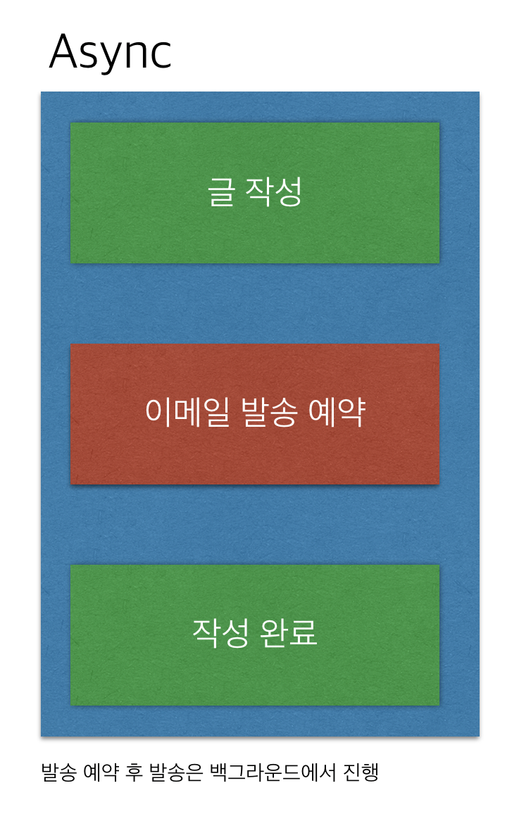
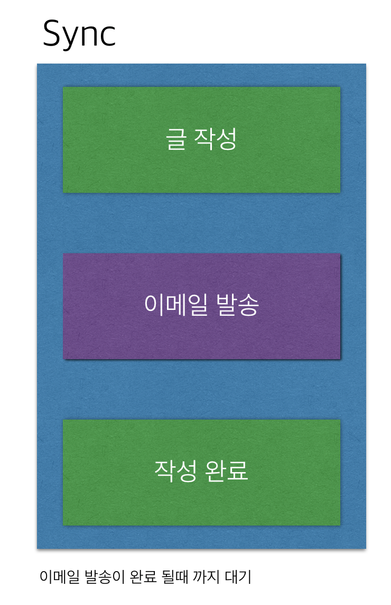
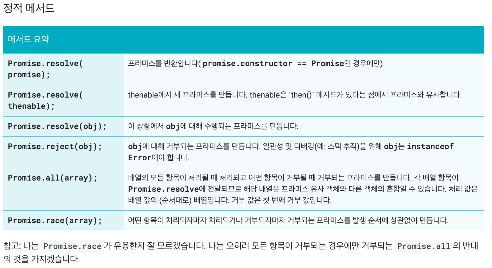
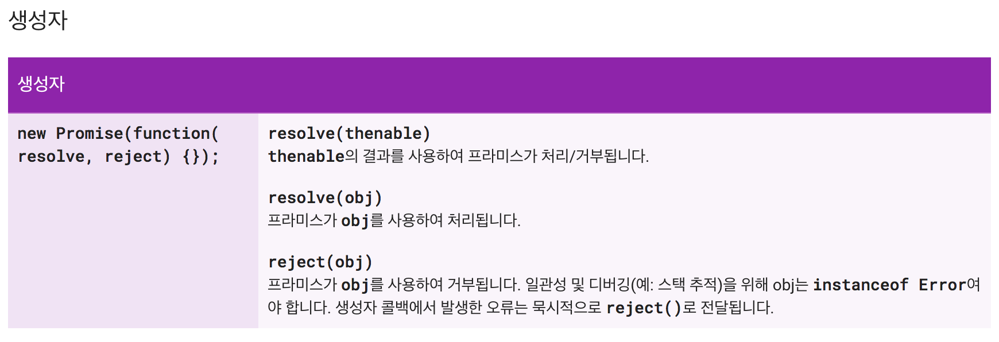
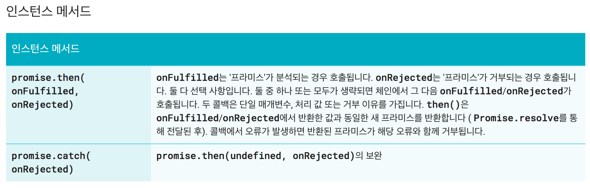

## Async/Callback

### 1. Async 와 Sync
1. Sync 란?
- 실행 순서가 절차 적이다.
- 코드의 작성 순데대로 실행된다.

2. Async 란?
- Async는 전 명령의 수행이 끝나지 않아도 다음 명령을 실행한다는 의미이다.

3. 예제 : 작성한 이메일을 1000명에게 보낸다.
> 
> 

- 위 예제 와 같이 Async는 이메일 발송 작업 예약 후 백그라운드에서 진행 하고 이메일 작성을 먼저 완료 할수 있다. 이메일 발송은 백그라운드에서 진행하며 사용자는 다른 작업 수행이 가능하다. 하지만  sync는 절차적으로 명령이 수행 되며 1000명에게 이메일 발송이 끝나야 이메일 작성이 완료 되며 이메일 발송을 수행하는 동안은 다른 작업을 수행 할 수 없다.

4. javascript에서 왜 Async 가 중요한가?
- javascript는 다른 언어와 다르게 단일 스레드로 동작한다. 단일 스레드는 하나의 스레드가 모든 명령을 처리 해야 하기 때문에 동기적으로 처리한다면 연산이 많은 로직을 처리할때는 그 연산이 끝날때 까지 계속 기다려야 하는 이슈가 있다. 그렇기 때문에 비동기적 처리를 통해 시간이 많이 걸리는 연산들을 백그라운드에서 처리하고 다른 작업을 수행 할수 있도록 하기위해 Async 개념은 꼭 필요하다.

5. 코드 예제
- 코드
~~~javascript
for (var i = 0; i < 10; i++) {
	setTimeout(function() {
		console.log(i);
	}, 10);
}
console.log('done');
~~~
- 결과 
~~~
done
10
10
10...
~~~
-  우선 for 문을 수행 후 맨 아래에 있는 console.log를 먼저 수행 한다. 그 후 queue에 들어있던 setTimeout의 콜백 함수를 실행 시키기 때문에 위의 결과가 제공 되었다.

### 2. Callback
1. Callback 이란?
- JavaScript에서는 함수도 객체이기 때문에 파라미터로 넘길 수 있고, 넘겨받은 함수를 언제 실행할지 결정할 수 있다. 모든 명령의 실행을 마친 후에 넘겨받은 함수객체를 실행시키는 것도 가능한데 이것이 바로 Callback 함수 이다.
- parameter로 함수를 전달하는 의미도 있다.

2.  코드 예제
-  코드 
~~~javascript
document.getElementById("myBtn").addEventListener("click", function(){
    document.getElementById("demo").innerHTML = "Hello World";
});
~~~
- 위의 예제는 우리가 많이 사용하는 이벤트 리스너이다. 버튼을 클릭시 해당 이벤트가 발생하면 지정 해둔 콜백함수가 실행 되도록 한다. 이와 같이 콜백함수를 예약 해놓고 이벤트가 클릭 되면 해당 콜백함수를 실행 시키도록 비동기 처리를 하였다.

3. Callback 함수 사용시 Call 과 Apply를 통한 this 보호
- callback으로 전달된 함수안에서 this를 사용하면 this의 특성(실행될때 context가 정해짐)으로 인해 복잡해질 가능 성이 크다. 이러한 단점을 해결하기위해 call, apply, bind 함수들을 통해 context를 지정 해준다.

~~~javascript
function getUserInput(firstName, lastName, callback, callbackObj) { 
	callback.apply (callbackObj, [firstName, lastName]); 
}
~~~
- 위의 예제와 같이 callback함수에서 사용되는 context인  callbackObj를 함께 전달하여 apply 함수를 통해 this의 context를 보호 할수 있다.

### 3. Promise

1. promise 란?
- 프론트엔드의 규모가 커지면서 복잡도가 커졌다.
- 하나의 비동기 작업을 처리한 후 순차적으로 다음 비동기 작업 할때 콜백 중첩이 되면서 `callback hell`이 일어난다. `callback hell`을 해결하기 위해 promise 패턴을 사용한다.
- 이전에는 Q, Vow, Bluebird등 다양한 라이브러리를 사용하여 `callback hell`을 해결 하였다. 
- promise 패턴을 사용하면 비동기 작업들을 순차적으로 진행 하면서 callback control이 쉬워지고 가독성이 좋아진다.
- ES6 스펙에 정식 포함.

**그림**

**promise 상태**
대기중(pending): 초기 상태, 이행 또는 거부되지 않은 상태.
이행됨(fulfilled): 연산이 성공리에 완료되었음을 뜻한다.
거부됨(rejected): 연산이 실패했음을 뜻한다.
settled: 연산이 성공했던 안했던 결론이 난 상태이다.

promise 예제
~~~javascript
//Promise 선언
var _promise = function (param) {

	return new Promise(function (resolve, reject) {

		// 비동기를 표현하기 위해 setTimeout 함수를 사용 
		window.setTimeout(function () {

			// 파라메터가 참이면, 
			if (param) {

				// 해결됨 
				resolve("해결 완료");
			}

			// 파라메터가 거짓이면, 
			else {

				// 실패 
				reject(Error("실패!!"));
			}
		}, 3000);
	});
};

//Promise 실행
_promise(true)
.then(function (text) {
	// 성공시
	console.log(text);
}, function (error) {
	// 실패시 
	console.error(error);
});
~~~

> 1. `_promise` 함수를 실행. 
> 2. `new Promise`를 통해 promise 객체를 생성하면서 인자로 전달한 callback 함수를 바로 실행. 
> 3. `window.setTimeout` 함수 실행. 
> 4. `Promise` 객체의 인스턴스 메소드인 `then` 함수 실행. 
> 5. 3초 후 `window.setTimeout`의 callback 함수 실행. 
> 6. 성공 시 `resolve` 함수 실행, 실패 시 `reject` 함수 실행. 해당 함수들로 인자로 전달된 값을 then 함수의 `callback` 함수로 전달. 
> 7. `then` 함수에 전달한 callback 함수 실행.

2. Promise.catch 
- `.then(null,function(){})`를 메소드 화 시킨것이다.

catch 예제
~~~javascript
_promise(true)
	.then(JSON.parse)
	.catch(function () { 
		window.alert('체이닝 중간에 에러가!!');
	})
	.then(function (text) {
		console.log(text);
});
~~~
실패 하게 되면 `catch` 함수의 콜백 함수가 실행된다.

3. Promise.all
- 여러개의 비동기 작업들이 있다면 모두 완료 된후 다른 작업을 실행 하고 싶다면 `all` 함수를 사용하면 된다.

all 예제
~~~javascript
var promise1 = new Promise(function (resolve, reject) {

	// 비동기를 표현하기 위해 setTimeout 함수를 사용 
	window.setTimeout(function () {

		// 해결됨 
		console.log("첫번째 Promise 완료");
		resolve("11111");

	}, Math.random() * 20000 + 1000);
});

var promise2 = new Promise(function (resolve, reject) {

	// 비동기를 표현하기 위해 setTimeout 함수를 사용 
	window.setTimeout(function () {

		// 해결됨 
		console.log("두번째 Promise 완료");
		resolve("222222");

	}, Math.random() * 10000 + 1000);
});

Promise.all([promise1, promise2]).then(function (values) {
	console.log("모두 완료됨", values);
});
~~~
`promise1`, `promise2` 인스턴스를 배열로 만들어 여러 비동기 작업을 실행후 then 함수를 통해 다음 작업을 실행한다.

4. promise ajax 예제
- [내용작성필요]

5. promise API
   
   
   

#### 출처
- http://yubylab.tistory.com/entry/자바스크립트의-콜백함수-이해하기
- https://hyunseob.github.io/2015/08/09/async-javascript/
- https://developer.mozilla.org/ko/docs/Web/JavaScript/Reference/Global_Objects/Promise
- https://developers.google.com/web/fundamentals/getting-started/primers/promises

