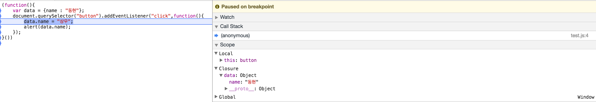

## javascript checklist01

### 1. 자바스크립트 scope를 var키워드르를 기준으로 설명할수 있다.
**scope의 종류**

- Global scope		
  - 함수 밖에서 사용하는 scope
  - 웹페이지의 모든 script와 function 에서 접근 할수 있는 scope 

~~~javascript
var carName = "Volvo";
//Volvo
// code here can use carName
function myFunction() {    
  carName = "MyCar"    //MyCar
} 
carName = "NiceCar"//NiceCar
~~~
위 예제에서 Global Scope 선언된 `var carName`는 어디서든 접근이 가능하다. 그렇기 때문에
`myFunction` 함수안에서도 `carName` 변수를 접근할수 있으며 밖에서도 접근이 가능하다.

- Function scope
  - function 내부에서 정의 된 변수는 function 외부에서 접근이 불가능하다. 
  - `{}`와 같은 `block scope`은 무시한다.
~~~javascript
// code here can not use carName
function myFunction() {
    var carName = "Volvo";
    // code here can use carName
}
carName = "NiceCar"
~~~
위 예제에서 function scope 안에서 선언된 `var carName`는 선언된 함수 내에서만 사용이 가능하다. 그렇게 함수 외부에서 carName에 접근 할 시 function 내부에 있는 `carName`를 접근 하는 것이 아닌 `window.carName`의 property에 "NiceCar"를 할당 한다. 

### 2. closure 는 언제 형성되는지? 경험한 코드가 있으면 코드로 보여주기.
**클로저는 언제 형성되는가?**

클로저는 외부 함수에서 선언 한 지역변수를 외부함수의 실행 이후에 내부 함수의 영역에서 사용할 때 생기는 scope 이다.

~~~javascript
function makeFunc() {
  var name = "Mozilla";
  function displayName() {
    alert(name);
  }
  return displayName;
}

var myFunc = makeFunc();
myFunc();
~~~
위의 예제에서 `makeFunc()`을 실행시키면 이미 `makeFunc()`안의 `name`변수는 lifecycle이 끝났다. 하지만 `makeFunc()`의 내부 함수인 `displayName`을 `myFunc` 변수에 저장 하고 실행 시키면 이미 lifecycle이 끝난 name을 참조한다. 이때 클로저라는 scope 또는 공간이 형성 된다.

**경험한 코드**

**html**
~~~html
<!DOCTYPE html>
<html>
  <head>
    <meta charset="utf-8">
    <title></title>
  </head>
  <body>
  <button>good</button>
  
  </body>
</html>
~~~

**javascript**
~~~javascript
(function(){
	var data = {name : "동현"};
	document.querySelector("button").addEventListener("click",function(){
      	data.name = "상우";
      	alert(data.name);
	});
}())
~~~
위 예제와 같이 즉시 실행 함수를 실행 시키면 해당 함수 내부의 `data`변수의 lifecycle은 종료 된다. 그후 `button` element의 콜백 함수에서 `data`의 참조를 통해 `data`변수를 사용 할때 클로저 공간이 생성 된다.

**결과**

### 3. const는 언제 사용해야 하는지?
**특징**

- const는 let과 동일하게  block scope을 가진다.
- const는 재할당이 되지 않는 속성 때문에 선언후 바로 초기화 하여야 한다.
~~~javascript
const NUM = 123;
NUM = 456; 
// TypeError: Assignment to constant variable.
~~~

- const는 유지보수와 가독성을 위해 사용한다.(다른 언어의 상수 선언 처럼 사용. 하지만 상수와 같이 절대 불변 하지는 않음.)
~~~javascript
const MAX = 10;
if (x > MAX) {
}
~~~

- 객체의 프로퍼티는 보호되지 않는다. (재할당은 불가능하지만 할당된 객체의 내용은 변경 가능.)

~~~javascript
const PERSON = {
  name: 'kim',
  address: {
    city: 'Seoul'
  }
};

user.name = 'Lee';

console.log(user); 
// { name: 'Lee', address: { city: 'Seoul' } }

Object.freeze(user);

user.name = 'Kims';

console.log(user); 
// { name: 'Lee', address: { city: 'Seoul' } }
~~~
위의 예제에서와 같이 PERSON 이라는 변수에 재할당은 불가능하지만 PERSON의 property 수정은 가능하다. 객체의 property까지 보호하기 위해서는 `Object.freeze()` 메소드를 사용 해야한다. `Object.freeze()`메소드를 사용하면 객체의 프로퍼티까지 보호 가능하다.

~~~javascript
user.address.city = 'Newyork';

console.log(user); 
// { name: 'Lee', address: { city: 'Newyork' } }
~~~
하지만 객체안의 객체의 property의 변경은 허용 된다. 이런 경우에는 내부에 있는 객페도 `Object.freeze()`메소드를 사용하여 변경을 막아야 한다. 

~~~javascript
function deepFreeze(obj) {
  const props = Object.getOwnPropertyNames(obj);
  props.forEach((name) => {
    const prop = obj[name];
    if(typeof prop === 'object' && prop !== null) {
      deepFreeze(prop);
    }
  });
  return Object.freeze(obj);
}

deepFreeze(user);
user.address.city = "Busan";

console.log(user); 
// { name: 'Lee', address: { city: 'Newyork' } }
~~~
`deepFreeze` 함수를 이용해서 객체의 property 전체를 변경 못하게 할수 있다. 

**언제 사용하는가?**
- ES6를 사용시 `var` 보다는 `let`,`const` 사용을 지향.
- 변경이 발생하지 않는(재할당이 필요없는) primitive형 변수와 객체형 변수에 const를 사용.
- const는 유지보수와 가독성을 위해 사용.
- const는 상수(변하지 않는 값)를 위해 사용.

### 4. mvc방식으로 개발한 사례가 있다면 본인이 느끼는 장단점을 설명하기.