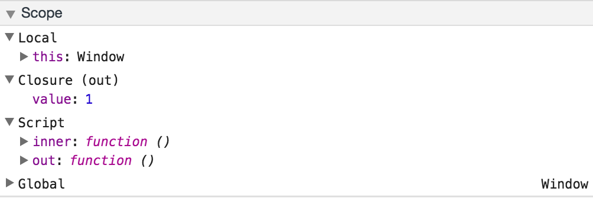

## Closure

### 설명
- outter 함수 안에 inner 함수 가 포함되어있다면 inner 함수에서 outter함수의 parameter와 변수들을 접근 할수 있다.(this / argument는 예외)
- inner 함수가 outter 함수가 더 오래 남아있는 경우가 특별하다. 
- inner함수를 위한 outter함수의 지역변수 또는 parameter가  outter함수에 의해 inner함수가 반환된 이후에도 life-cycle이 유지되는 것을 의미한다. 
- outter 함수는 inner함수 안에서 정의된 변수와 함수를 접근 하지 못하게 되어있고 이는 inner함수의 변수를 보호한다.
- outter함수의 scope 밖에서 inner함수를 사용하면 cloure scope 이 사용된다.
- 스코프 체인이 클로저를 만든다.

### 중첩된 함수와 클로저
- 중첩된 함수 : 외부 함수 안에 내부 함수가 존재 하는 것, Closure scope을 생성한다.
- inner 함수를 형성 하는 클로저 : outter 함수는 inner 함수의 인수와 변수를 사용 할수 없는 반면에 inner 함수는 outter 함수의 arguments와 변수를 접근할 수 있다.

예제 1
~~~javascript
function addSquares(a,b) {
  function square(x) {
    return x * x;
  }
  return square(a) + square(b);
}
a = addSquares(2,3); // returns 13
b = addSquares(3,4); // returns 25
c = addSquares(4,5); // returns 41
~~~
위 예제에서 보면 `addSquares`에서 paramater값을 받아 inner 함수인 `square`함수에 paramater를 전달해 주어 실행 시키는 것이 가능하다. 

### 변수를 private 하게 사용
- 중첩된 inner 함수가 반환 될 때 outter 함수의 인수가 보존된다. 
- inner 함수의 메모리는 그 무엇도 내부 함수에 접근 하지 않을때만 해제된다.

예제 2
~~~javascript
function outside(x) {
  function inside(y) {
    return x + y;
  }
  return inside;
}
fn_inside = outside(3); // Think of it like: give me a function that adds 3 to whatever you give it
result = fn_inside(5); // returns 8

result1 = outside(3)(5); // returns 8
~~~
위의 예제에서 `inside`함수는 `outside`함수의 인자인 x를 참조 하고 있다. `outside` 함수가 `inside`함수를 반환 하면서 `outside`함수의 생명 주기는 끝났지만 `inside`함수에서는 x에 대한 참조를 계속 사용 한다. 그리고 x의 값을 외부에서 더이상 접근 하지 못하는 private 상태를 만들었다.

예제 3
~~~javascript
let out = function(){
let value = 0;
  return function () {
   value++;
   console.log("value",value);
  }
}
let inner = out();

inner();
inner();
~~~
위 예제에서 `out`함수를 호출하면 `out`함수의 `value`변수를 사용하는 함수가 inner 변수에 저장된다. 그리고 inner함수를 호출하면 closure scope을 생성하여 value 변수를 참조 한다. 이 value 변수는 외부에서 참조할수 없는 private한 속성을 가진다.

그림

### Tip

### 참고
- 자바스크립트 핵심 가이드(더글라스 크락포드 저)